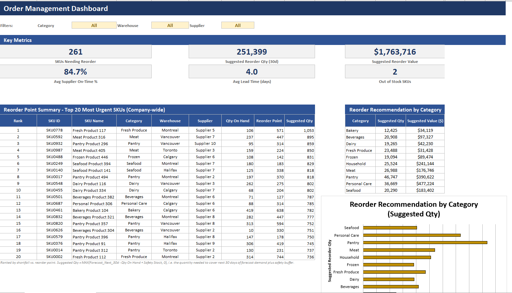

# GitHub Pages Site Content — Vignesh Portfolio
### Reference doc for the live, hand-coded multi-page site

This replaces the original single-page content plan below with a description of what's
**actually live** at `https://lvignesh1961.github.io/lvignesh_Portfolio/` (repo:
`https://github.com/lvignesh1961/lvignesh_Portfolio`, public). The site grew from the original
one-page plan into nine hand-coded HTML pages sharing a design system, a light/dark mode, and a
scroll-reveal animation system — this doc tracks that as-built state so it stays useful as a
reference instead of drifting from reality.

---

## Site map (as built)

```
index.html            Home — hero (with interactive particle animation) → Skills → Projects
                       preview (3 mini-cards) → Contact (Gmail icon)
experience.html        Experience — 3 role blocks, each with its own slide-in reveal
projects.html          Projects — filterable row list (All / Inventory / Retail & Forecasting /
                       Transportation), each row linking to its demo + case study
inventory-case-study.html         )
retail-case-study.html            ) full write-ups, each with a sticky sidebar TOC + scroll-spy
transportation-case-study.html    )
inventory-dashboard-demo.html         )
retail-dashboard-demo.html            ) standalone interactive product tours, each with its own
transportation-dashboard-demo.html    ) bespoke visual theme, plus the shared site nav on top
```

Not a single scrolling page as originally planned — Home, Experience, and Projects are separate
pages linked by a shared nav, and each project has its own case-study page (full write-up) and
demo page (interactive tour), linked from a `projects.html` listing rather than embedded inline.

---

## 0. Design system (CSS)

### Fonts
```html
<link rel="preconnect" href="https://fonts.googleapis.com">
<link rel="preconnect" href="https://fonts.gstatic.com" crossorigin>
<link href="https://fonts.googleapis.com/css2?family=Inter:wght@400;500;600;700;800&family=JetBrains+Mono:wght@400;500&display=swap" rel="stylesheet">
```
(`JetBrains Mono` is used sparingly — filter-chip counts, mono labels — not a primary font.)

### CSS variables — light + dark
Every page defines the same token set in `:root`, then re-defines the color tokens under
`html[data-theme="dark"]` (see [Dark mode](#dark-mode-system) below):

```css
:root {
  --color-bg: #ffffff;
  --color-text: #0a0a0a;
  --color-text-muted: #6b7280;
  --color-border: #e5e7eb;
  --color-surface: #f9fafb;
  --color-accent: #4f46e5;
  --color-accent-hover: #4338ca;
  --color-accent-soft: #eef2ff;
  --header-bg: rgba(255,255,255,.9);

  --font-sans: 'Inter', ui-sans-serif, system-ui, -apple-system, 'Segoe UI', Roboto, sans-serif;
  --font-mono: 'JetBrains Mono', ui-monospace, 'SFMono-Regular', Menlo, monospace;

  --container-max: 1140px;   /* 1040px on case-study pages (to fit the sidebar); 860px was the old value before the sidebar was added */
  --radius-md: 12px;
  --radius-full: 999px;
  --space-section: 56px;     /* reduced from an original 96px — see "Spacing" below */
}

html[data-theme="dark"] {
  --color-bg: #0b0d12;
  --color-text: #f2f3f5;
  --color-text-muted: #9aa1ac;
  --color-border: #262b33;
  --color-surface: #151821;
  --color-accent: #8388ff;
  --color-accent-hover: #9ba0ff;
  --color-accent-soft: #1b1e33;
  --header-bg: rgba(11,13,18,.85);
}
```

Base rules unchanged from the original plan (`body`, `.container`, `section`, headings, `.muted`,
link styles) — see any live page's `<style>` block for the exact current copy.

### Components (unchanged in spirit from the original plan, still current)
- `.btn` / `.btn-primary` / `.btn-outline` — buttons.
- `.stat-row` / `.stat` / `.stat-number` / `.stat-label` — KPI chip rows.
- `.tag` — pill chips; now `display:inline-flex` with a `<svg>` icon slot before the label (see
  [Skills section](#skills-section) below) rather than plain text.
- `.card` — bordered project card (used on `projects.html`'s case-study-style layout precursor;
  current `projects.html` uses `.row` instead, see below).
- `.eyebrow` — small accent-colored label above a heading. **Removed** from Home's Skills and
  Contact headings (was rendering as a visually duplicate mini-title right above the real
  heading) — still used elsewhere (case-study hero eyebrows, Projects page eyebrow).

---

## 1. Shared header / navigation

Every page includes the same header, sticky at the top:

```html
<header class="site-header">
  <div class="container nav">
    <span class="brand">Vignesh <span class="brand-sub">| Supply Chain &amp; Data Analytics</span></span>
    <button class="nav-toggle" type="button" aria-label="Menu" aria-expanded="false" data-nav-toggle>
      <svg width="20" height="20" viewBox="0 0 20 20" fill="none"><path d="M2 5h16M2 10h16M2 15h16" stroke="currentColor" stroke-width="2" stroke-linecap="round"/></svg>
    </button>
    <nav data-nav-list>
      <a href="index.html">Home</a>
      <a href="experience.html">Experience</a>
      <a href="projects.html">Projects</a>
      <a href="index.html#contact">Contact</a>
      <button class="theme-toggle" type="button" aria-label="Toggle dark mode" data-theme-toggle>
        <svg class="icon-moon" viewBox="0 0 24 24" ...>...</svg>
        <svg class="icon-sun" viewBox="0 0 24 24" ...>...</svg>
      </button>
    </nav>
  </div>
</header>
```

**Mobile nav (≤768px):** below 768px, `.nav-toggle` (hamburger) becomes visible and
`nav[data-nav-list]` — the *same* element that holds the desktop links — becomes an
absolutely-positioned dropdown panel (`display:none` until `.is-open`), each link rendered as a
full-width, clearly-divided row (16px text, 14px vertical padding) rather than the old
cramped inline-wrapped links. A small JS toggle (`data-nav-toggle` click handler) opens/closes it,
closes on outside click, and auto-closes if the viewport is resized back past 768px.

**`brand-sub` collapse:** the "| Supply Chain & Data Analytics" tagline is hidden below 560px
(`display:none` on `.brand-sub`) so only "Vignesh" + the nav remain on narrow phones.

**Dark-mode toggle placement:** lives as the *last item inside* `nav[data-nav-list]` — on
desktop it renders as a small icon button beside Contact; because it's inside the same element
that becomes the mobile dropdown, it automatically appears as a full-width "Dark mode"/"Light
mode" row inside the hamburger menu on mobile too, with zero separate mobile-only markup.

### Interactive demo pages get the same header
The three `*-dashboard-demo.html` pages originally had **no** site nav at all (fully standalone
tools). They now include the identical header markup/behavior, styled in the site's own
Inter/indigo format rather than each demo's bespoke theme (IBM Plex Sans/amber-steel for
inventory, Source Serif/gold-green for retail, Barlow Semi Condensed/orange-teal for
transportation) — the header's `--color-*` CSS variables are scoped so they don't collide with
each demo's own `--paper`/`--panel`/`--ink`/accent-color variables used for the rest of that page.

---

## Dark mode system

- Toggled via the nav's sun/moon button (see above); state persisted to `localStorage('theme')`.
- Applied via `html[data-theme="dark"]` attribute, set by an inline `<script>` in `<head>`
  **before** first paint (reads localStorage synchronously) to avoid a flash of the wrong theme:
  ```html
  <script>try{if(localStorage.getItem('theme')==='dark')document.documentElement.setAttribute('data-theme','dark');}catch(e){}</script>
  ```
- Click handler (near the end of `<body>` on every page):
  ```js
  document.querySelectorAll('[data-theme-toggle]').forEach(function (btn) {
    btn.addEventListener('click', function () {
      var isDark = document.documentElement.getAttribute('data-theme') === 'dark';
      if (isDark) { document.documentElement.removeAttribute('data-theme'); localStorage.setItem('theme','light'); }
      else { document.documentElement.setAttribute('data-theme','dark'); localStorage.setItem('theme','dark'); }
    });
  });
  ```
- **On the 6 main site pages** (Home/Experience/Projects/3 case studies): dark mode re-themes the
  whole page, since every color already flowed through the shared `--color-*` variables.
- **On the 3 interactive demo pages**: dark mode re-themes the *entire* demo too, not just the
  shared nav — each demo's own palette (`--paper`, `--panel`, `--ink`, `--ink-soft`, `--line`,
  plus its project-specific accent pair) gets its own `html[data-theme="dark"]` override
  (brightened variants of the same hues, so Inventory stays amber/steel-flavored, Retail stays
  gold/green, Transportation stays orange/teal — just readable on a dark background). A handful
  of literal hex colors that couldn't be reached by variables (badge/chip/pill backgrounds,
  formula-box backgrounds, inline SVG chart fills/strokes for the route-map and forecast-trend
  diagrams) got explicit `html[data-theme="dark"] .badge.A{...}` / attribute-selector overrides
  (`svg rect[fill="#E4EFEF"]{...}`) alongside the variable changes.

---

## Scroll-reveal animation system

Content fades/slides into view as you scroll, on every main page (not the demo pages, which have
their own step-based interaction model instead). Same three-layer defensive pattern documented
from harrisonjansma.com in `Website clone.md`:

```css
.js-reveal [data-reveal]{
  opacity: 0; transform: translateY(24px);
  transition: opacity .6s cubic-bezier(.22,.7,.2,1), transform .6s cubic-bezier(.22,.7,.2,1);
}
.js-reveal [data-reveal].is-in{ opacity: 1; transform: none; }
@media (prefers-reduced-motion: reduce){
  .js-reveal [data-reveal]{ opacity: 1 !important; transform: none !important; transition: none; }
}
```
```js
// IntersectionObserver primary path, scroll/resize rect-check fallback,
// 1.5s hard deadline so nothing stays invisible without JS.
// Initial check wrapped in a DOUBLE requestAnimationFrame — a single rAF let
// above-the-fold elements (e.g. projects.html's page head/rows) get marked
// .is-in before the browser had painted their opacity:0 state even once,
// skipping the transition entirely instead of animating it.
requestAnimationFrame(function () { requestAnimationFrame(check); });
```

**Per-page variations on the base fade-up:**
- **Home**: hero / skills / projects-preview / contact each reveal as one block.
- **Projects**: page head + each row reveal individually.
- **Case studies**: hero block + every `<h2>` heading reveals individually (a lighter-weight
  progressive reveal down the long-form write-up, rather than wrapping every paragraph).
- **Experience**: each of the 3 role blocks gets a **horizontal slide** instead of the generic
  vertical fade — alternating left/right/left as you scroll:
  ```css
  .js-reveal .exp-item[data-reveal]{ transform: translateX(-48px); transition-duration: .7s; }
  .js-reveal .exp-item--right[data-reveal]{ transform: translateX(48px); }
  .js-reveal .exp-item[data-reveal].is-in{ transform: none; }
  ```
  (`body{overflow-x:hidden;}` added as a safety guard against the translateX starting offset
  creating a transient horizontal scrollbar.)

---

## 2. Home page (`index.html`)

### Hero — headline + interactive particle animation
```html
<section id="home">
  <canvas id="hero-particles" aria-hidden="true"></canvas>
  <div class="container" data-reveal>
    <h1>Vignesh</h1>
    <p class="muted">Supply Chain &amp; Data Analytics Professional</p>
    <p>Supply Chain Analytics professional specializing in demand forecasting, inventory planning, and cross-functional data-driven decisions — skilled in SQL, Python, Power BI, and Microsoft Fabric.</p>
  </div>
</section>
```
```css
#home { position: relative; overflow: hidden; }
#home canvas#hero-particles { position: absolute; inset: 0; width: 100%; height: 100%; z-index: 0; }
#home .container { position: relative; z-index: 1; pointer-events: none; }
```

**The animation** (referred to as the "spline"/particle animation): a mouse-reactive network of
dots connected by fading lines, sitting behind the hero text — the same idea as
[yan-holtz.com](https://www.yan-holtz.com/)'s `particles.js`-powered hero (documented in
`Website clone.md`), but rebuilt as a **dependency-free `<canvas>` script** instead of pulling in
the `particles.js` library, specifically so it could be theme-aware and match this site's own
indigo accent:

- Particle count scales with the hero's actual area (`clamp(24, (W×H)/13000, 70)`) instead of
  `particles.js`'s fixed 80, so density stays proportionate at any viewport size.
- Particles drift slowly (`vx/vy` ≈ ±0.35px/frame) and bounce off the section's edges.
- A line is drawn between any two particles within 130px, with opacity fading by distance
  (mirrors `particles.js`'s `line_linked`).
- Hovering the hero repels nearby particles within a 90px radius (mirrors `repulse` mode).
- Clicking adds 4 new particles at the click point, capped at 110 total (mirrors `push` mode).
- Colors are re-read from `document.documentElement`'s `data-theme` attribute **every frame**:
  `rgba(79,70,229,.38)` dots / `.14` lines in light mode, `rgba(157,161,255,.6)` / `.22` in dark —
  so toggling the site's dark-mode switch re-colors the animation instantly with no re-init,
  unlike `particles.js`'s static JSON config.
- Under `prefers-reduced-motion: reduce`, the script draws **one static frame** and skips the
  animation loop and all mouse/click listeners entirely, rather than just disabling CSS
  transitions (there are none to disable — this is canvas-drawn, not CSS-animated).

### Skills section
Split into **two labeled groups** (down from one flat 22-item list), each chip now carrying a
small monochrome brand `<svg>` icon (sourced from [Simple Icons](https://simpleicons.org)) before
its label:

```
Analytics & Data Platforms
  Power BI · SAP · Power Query · Tableau · AWS Redshift · Oracle NetSuite

Collaboration & Productivity
  Jira · Confluence · Microsoft Suite · Google Suite
```
(Power Query has no official Simple Icons entry — uses a generic funnel glyph instead of a fake
brand mark. AWS Redshift and Microsoft Suite/Google Suite reuse their parent brand's general logo
since no product-specific icon exists.) Everything else from the original 22-item list (Azure, MS
Excel, Google Cloud, Snowflake, Python, Pandas, NumPy, PyTorch, SQL, Linux Environments, Plotly,
VBA) was dropped in the split.

```css
.tag { display: inline-flex; align-items: center; gap: 7px; /* ...unchanged border/bg/radius... */ }
.tag svg { width: 14px; height: 14px; }
.skill-group-label { font-size: 12.5px; font-weight: 600; text-transform: uppercase; letter-spacing: .05em; color: var(--color-text-muted); margin-bottom: 10px; }
```

### Projects preview (new — fills what was an empty gap between Skills and Contact)
A compact 3-card grid, each card a thumbnail screenshot + category tag + title + one-line summary
linking straight to that project's case study, plus a "View all projects" button to
`projects.html`:

```html
<section id="featured-projects">
  <div class="container" data-reveal>
    <h2>Projects</h2>
    <p class="muted">A quick look — full write-ups and interactive demos on the <a href="projects.html">Projects page</a>.</p>
    <div class="mini-grid">
      <a class="mini-card" href="inventory-case-study.html">
        
        <div class="mini-card-body">
          <span class="tag">Inventory</span>
          <h3>Inventory Management Dashboard</h3>
          <p>Live reorder-point and ABC/Pareto stock-health dashboard across 1,000 SKUs.</p>
        </div>
      </a>
      <!-- ...repeat for Retail, Transportation... -->
    </div>
    <a class="btn btn-outline" href="projects.html">View all projects</a>
  </div>
</section>
```
`.mini-grid` is `repeat(3,1fr)` on desktop, `1fr 1fr` at ≤768px, `1fr` at ≤480px.

### Contact section
No more "Email: ..." text or a text-label button — just a single Gmail logo icon linking to
`mailto:`:
```html
<a class="gmail-link" href="mailto:lvignesh1961@gmail.com" aria-label="Email lvignesh1961@gmail.com">
  <svg viewBox="52 42 88 66" xmlns="http://www.w3.org/2000/svg">
    <!-- official 2020 Gmail "M" mark, 5 paths, from Wikimedia Commons Gmail_icon_(2020).svg -->
  </svg>
</a>
```
`.gmail-link` is a 56×56px rounded card (`border`, subtle `box-shadow`) with a lift-on-hover; the
icon itself is rendered at `32×24px` to preserve its native 4:3 aspect ratio rather than being
squashed into a square.

---

## 3. Experience page (`experience.html`)

Section eyebrow/numbering ("02 — Experience") removed; city/province (Vancouver, BC / Surrey, BC)
removed from each role's org line. Each of the 3 blocks:

```html
<div class="exp-item" data-reveal> <!-- middle one: class="exp-item exp-item--right" -->
  <h3>Global Supply Chain Analyst</h3>
  <p class="exp-org">Motorola Solutions — September 2024 – Present</p>
  <p>Built SQL/Python-driven dashboards and portfolio analytics frameworks (Redshift, Tableau) to monitor lifecycle risk across multi-level component and product dependencies, improving decision accuracy by <span class="highlight">25%</span>.</p>
  <p>Led cross-functional analytics initiatives supporting <span class="highlight">$5M+</span> quarterly revenue commitments and <span class="highlight">20%</span> faster project delivery.</p>
</div>
```
See [Scroll-reveal animation system](#scroll-reveal-animation-system) above for the slide-in
behavior. Inline `<span class="highlight">` wraps key metrics in the accent color — the one
change actually kept from the original plan's "*Style note*" about foregrounding figures.

---

## 4. Projects page (`projects.html`)

Rebuilt from the original plan's flat `.card` list into a **filterable row list**, modeled on
[harrisonjansma.com/projects](https://harrisonjansma.com/projects)'s pattern:

```html
<div class="filters" id="filters">
  <button class="filter is-active" data-filter="all">All projects<span>3</span></button>
  <button class="filter" data-filter="inventory">Inventory<span>1</span></button>
  <button class="filter" data-filter="retail">Retail &amp; Forecasting<span>1</span></button>
  <button class="filter" data-filter="transportation">Transportation<span>1</span></button>
</div>

<div class="rows">
  <div class="row" data-cat="inventory" data-reveal>
    <span class="row-index">01</span>
    <div>
      <span class="row-cat">Inventory Analytics</span>
      <a class="row-title" href="inventory-case-study.html">Inventory Management Dashboard</a>
      <p class="row-desc">...</p>
      <div><span class="tag">Excel</span><span class="tag">SUMIFS</span>...</div>
      <div class="stat-row">...</div>
    </div>
    <div class="row-actions">
      <a class="btn btn-primary" href="inventory-dashboard-demo.html">Try interactive demo</a>
      <a class="btn btn-outline" href="inventory-case-study.html">Read case study</a>
    </div>
  </div>
  <!-- ...retail, transportation... -->
</div>
```
Filter JS toggles `row.style.display` based on `data-filter` vs. each row's `data-cat` — plain
vanilla JS, no framework, same pattern as harrisonjansma.com's `armFilters()`. Screenshots are no
longer embedded inline here (that was the pre-case-study-page design) — each row links out to its
demo and case study instead.

---

## 5. Case-study pages (all three: inventory / retail / transportation)

Full write-up (Why I built this / What this is-and-isn't / The architecture / The parts that were
actually hard / What the numbers say / What I'd do differently at scale / Stack), each with:

**A sticky sidebar table of contents**, added after the pages already existed:
```html
<div class="container case-body-layout">
  <nav class="case-toc" aria-label="Sections on this page">
    <a href="#why">Why I built this</a>
    <a href="#what-it-is">What this is</a>
    <a href="#architecture">The architecture</a>
    <a href="#hard-parts">The hard parts</a>
    <a href="#numbers">What the numbers say</a>
    <a href="#scale">At production scale</a>
    <a href="#stack">Stack</a>
  </nav>
  <div class="case-content"> <!-- h2s with matching ids, existing prose --> </div>
</div>
```
```css
.case-body-layout { display: grid; grid-template-columns: 200px minmax(0,1fr); gap: 48px; }
.case-toc { position: sticky; top: 84px; }
.case-toc a.is-active { color: var(--color-accent); font-weight: 600; border-left-color: var(--color-accent); background: var(--color-accent-soft); }
```
`--container-max` widened from 860px to **1040px** on these pages to fit the 200px sidebar
alongside the original reading-width content column. Sidebar collapses entirely below 900px
(`display:none` — no room for it next to content on tablet/mobile).

**Scroll-spy** (which link is highlighted) went through one bug fix: the first version used an
`IntersectionObserver` watching only the `<h2>` elements with a narrow `rootMargin` band, which
frequently mis-highlighted once you scrolled past a heading into its body text. Replaced with a
direct scroll-position comparison — on scroll (throttled via `requestAnimationFrame`), find the
last section whose top has been passed (with a 110px offset for the sticky header) and mark that
link active; snaps to the last link when scrolled to the very bottom of the page.

Each `<h2>` also got `scroll-margin-top: 90px` and `html{scroll-behavior:smooth}` so clicking a
sidebar link scrolls smoothly to a heading that isn't hidden under the sticky site header.

---

## 6. Interactive demo pages (all three)

Standalone step-by-step "interactive tour" pages (their own hero, KPI row, rail navigation +
stage, table/chart panels) — each with a genuinely distinct visual identity per project:

| Demo | Fonts | Accent colors |
|---|---|---|
| `inventory-dashboard-demo.html` | IBM Plex Sans + IBM Plex Mono | amber `#D98A1D` / steel `#2F5F73` |
| `retail-dashboard-demo.html` | Source Serif 4 + IBM Plex Mono + Inter | gold `#C68A2E` / green `#1F6650` |
| `transportation-dashboard-demo.html` | Barlow Semi Condensed + IBM Plex Mono + Inter | orange `#D9642F` / teal `#1C6E73` |

These originally had **no nav bar at all** — pure standalone tools. Now include the shared
[site header](#1-shared-header--navigation) on top, in the site's own format (not the demo's
bespoke theme), and are fully wired into [dark mode](#dark-mode-system) — toggling it re-themes
the entire demo, not just the added header.

Fixed placeholder links: each demo's "Read the case study" CTA now points to the real
`<project>-case-study.html` page instead of a `#case-study` anchor stub.

---

## Responsive breakpoints

Every page now has a **layered** breakpoint system (originally just one ~640px mobile query):

| Breakpoint | Applies to |
|---|---|
| `1024px` | Tablet-landscape — reduced `--space-section`, narrower `--container-max` on some pages |
| `900px` | Case-study pages only — sidebar TOC collapses (`display:none`) |
| `860px` | `projects.html` row grid collapses to 2-column; demo pages narrow the rail sidebar (210px→170px) instead of jumping straight to mobile stacking |
| `768px` | Mobile nav breakpoint — hamburger appears, dropdown activates |
| `640px` | Original baseline mobile query (demo pages: KPI grid to 2 cols, rail fully stacks) |
| `560px` | `.brand-sub` tagline hidden |
| `480px` | Small-phone tier — tighter padding, smaller type, full-width buttons |

Large monitors were never a problem — `--container-max` already caps content width, so pages stay
comfortably centered rather than stretching edge-to-edge.

---

## Notes on filling remaining gaps

- No profile photo or downloadable résumé PDF exists anywhere on the site (the original
  `Resume_Vignesh.docx` was removed from the repo early on).
- Contact is now icon-only (Gmail logo) — no visible email text, LinkedIn, or phone number
  elsewhere on the site.
- All KPI numbers throughout were read directly off the dashboard screenshots, not invented.
- The repo is public — this is what makes both the `dashboard_screenshots/` raw-URL pattern (used
  in this doc's image references above) and GitHub Pages serving work.
